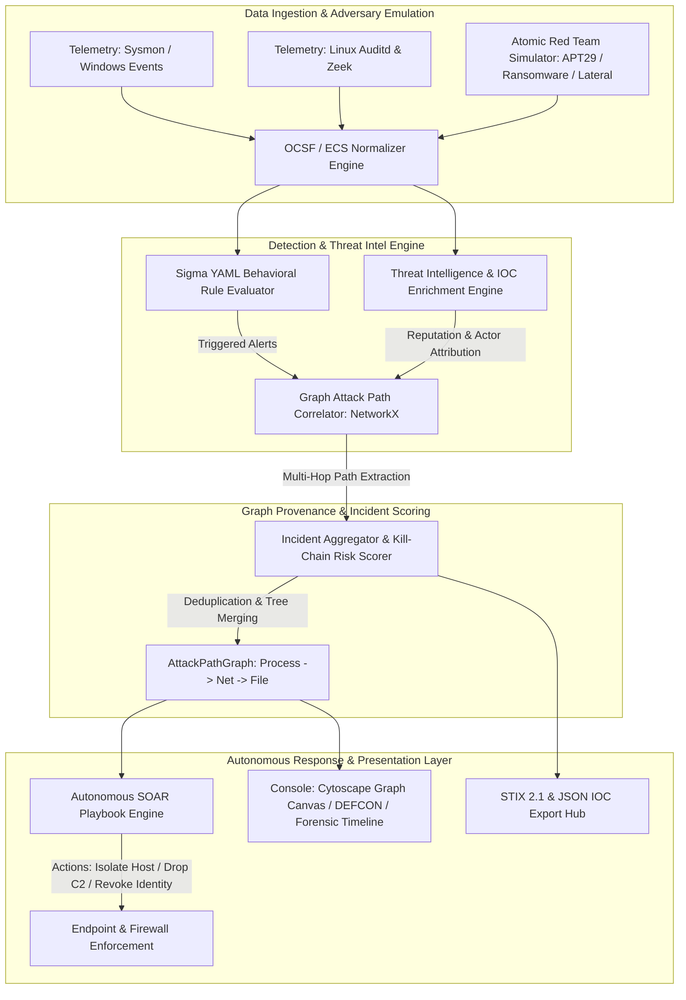

<div align="center">

# 🛡️ AegisGraph-SOC
### Next-Generation Graph-Correlated SIEM, Threat Intelligence & Autonomous SOAR Engine

[](https://www.python.org/)
[](https://fastapi.tiangolo.com)
[](https://getbootstrap.com/)
[](https://js.cytoscape.org/)
[](https://attack.mitre.org/)
[](https://oasis-open.github.io/cti-documentation/)
[](https://www.netlify.com/)
[](https://opensource.org/licenses/MIT)

<p align="center">
  <strong>An enterprise-grade, elite-tier Cybersecurity portfolio project demonstrating advanced capabilities in Detection Engineering, Multi-Hop Attack Path Reconstruction, Threat Hunting, and Autonomous Incident Response (SOAR).</strong>
</p>

[Key Features](#-key-features) •
[Architecture](#-system-architecture) •
[Quickstart](#-quickstart-guide) •
[Netlify Deployment](#-deployment-to-netlify) •
[Git Instructions](#-push-to-github--gitlab) •
[API Reference](#-api-endpoints) •
[Demonstration Guide](#-interview--recruiter-demonstration-guide)

---

</div>

## 📖 Executive Summary

Traditional Security Information and Event Management (SIEM) systems suffer from alert fatigue and context fragmentation because they evaluate logs as flat, disconnected tabular rows. 

**AegisGraph-SOC** resolves this problem by implementing a **stateful graph-based provenance engine**. It continuously ingests normalized telemetry (compliant with **OCSF / ECS** standards) and builds a live directed multigraph connecting processes, network egress connections, and filesystem artifacts. When a high-fidelity signature triggers, the engine performs bidirectional graph traversal:
1. **Upstream Traversal:** Identifies *Patient Zero* (Root Cause / Initial Execution vector).
2. **Downstream Traversal:** Identifies the full *Blast Radius* (child processes, command and control beacons, ransomware encryption footprints).
3. **Autonomous Mitigation (SOAR):** Orchestrates dynamic response protocols (endpoint isolation, process tree neutralization, identity suspension, and perimeter IP sinkholing).

---

## 🌟 Key Features

| Capability | Technical Description | Business & SOC Value |
| :--- | :--- | :--- |
| **Graph-Based Attack Correlation** | In-memory directed multigraph powered by NetworkX and visualized with Cytoscape.js. | Replaces hours of manual log stitching with an instant, interactive visual attack tree. |
| **Interactive Blast Radius Highlighting** | Clicking any node highlights ancestors (*Cyan*) and descendants (*Red*) while dimming unrelated telemetry. | Allows Tier 2/3 analysts to isolate the exact scope of an intrusion in seconds. |
| **Integrated Threat Intelligence** | Automatic IOC enrichment displaying ASN, country, reputation score (0-100), and threat actor attribution (*APT29, FIN7, LockBit*). | Instant context on adversary infrastructure without leaving the investigation canvas. |
| **STIX 2.1 & JSON IOC Hub** | 1-click export of correlated indicators of compromise in OASIS STIX 2.1 JSON bundle format. | Ready for immediate ingestion into MISP, OpenCTI, or firewall blocklists. |
| **Sigma Detection Rule Sandbox** | In-browser YAML editor with live syntax compilation, MITRE tagging validation, and hot-reload disk saving. | Demonstrates real-world Detection Engineering workflows without needing a server restart. |
| **Global DEFCON Threat Posture** | Real-time enterprise alert gauge (DEFCON 1 to 5) calculated dynamically from active incident risk scores. | Provides executive CISO-level visibility over the active threat landscape. |
| **Autonomous & Granular SOAR Defense** | 100% dynamic playbook execution (*Ransomware Rapid Containment* & *C2 Egress Severing*) with terminal audit logs. | Eliminates human response latency, containing threats before data exfiltration occurs. |
| **Adversary Emulation Engine** | Built-in Atomic Red Team simulator with 3 multi-stage APT campaigns. | Enables instant live demonstrations without requiring physical target machines or live malware. |

---

## 🏛️ System Architecture



---

## 🎯 Adversary Emulation Campaigns (Atomic Red Team)

The platform includes a built-in adversary emulation generator for realistic live demonstrations:

### 1. APT29 / CozyBear Campaign (Spearphishing & Credential Access)
* **Initial Access:** `OUTLOOK.EXE` opens attachment `Q3_Invoice_Overdue.docx` in `WINWORD.EXE`.
* **Execution:** Malicious VBA macro spawns hidden, encoded `powershell.exe` (`T1059.001`).
* **Command and Control:** PowerShell makes outbound HTTPS beacon connection to known Tor Exit Node `185.220.101.5:443` (`T1071.001`).
* **Credential Access:** Drops and invokes `procdump.exe` to dump `lsass.exe` memory to `lsass.dmp` (`T1003.001`).

### 2. BlackCat / ALPHV Ransomware Rapid Kill Chain
* **Execution:** `svchost.exe` exploit chain invokes `cmd.exe` (`T1059.003`).
* **Defense Evasion & Impact:** Spawns `vssadmin.exe delete shadows /all /quiet` to inhibit system recovery (`T1490`).
* **Data Impact:** Spawns multi-threaded payload `locker.exe` encrypting corporate file shares to `.locked` artifacts (`T1486`).

### 3. Active Directory Lateral Movement (PsExec & SMB Traversal)
* **Execution:** Compromised workstation runs administrative utility `psexec.exe` targeting internal Domain Controller (`10.0.0.1`).
* **Lateral Movement:** Outbound SMB traffic on Port 445 (`T1021.002`).
* **Privilege Escalation:** Spawns remote privileged shell `PSEXESVC.exe` running as `NT AUTHORITY\SYSTEM`.

---

## 🚀 Quickstart Guide

### Prerequisites
* **Python 3.10+**
* **Git**

### 1. Clone & Set Up Virtual Environment
```powershell
# Clone the repository
git clone https://github.com/<your-username>/AegisGraph-SOC.git
cd AegisGraph-SOC

# Create and activate virtual environment
python -m venv venv
.\venv\Scripts\Activate.ps1

# Install dependencies
pip install -r backend/requirements.txt
```

### 2. Run the Full-Stack Application
```powershell
$env:PYTHONPATH="."
python -m uvicorn backend.main:app --host 127.0.0.1 --port 8000 --reload
```
Open your browser and navigate to:
```
http://127.0.0.1:8000/
```

### 3. Execute Automated Test Suite (Pytest)
```powershell
$env:PYTHONPATH="."
python -m pytest backend/tests/ -v
```

---

## 🌐 Deployment to Netlify

AegisGraph-SOC features a **Hybrid Engine Architecture**. It runs full-stack with Python FastAPI when hosted on a server or container, and automatically transitions to an **In-Browser Client-Side Simulation Engine** when deployed as a static site on Netlify.

### 1-Click Netlify Deployment via Git
1. Push your repository to **GitHub** or **GitLab**.
2. Log in to [Netlify](https://app.netlify.com/).
3. Click **"Add new site"** &rarr; **"Import an existing project"**.
4. Select your `AegisGraph-SOC` repository.
5. Netlify will automatically detect `netlify.toml` with the following settings:
   * **Base directory:** *(leave empty)*
   * **Build command:** *(leave empty)*
   * **Publish directory:** `frontend`
6. Click **"Deploy site"**. Your interactive SOC platform is live instantly!

### Deploy via Netlify CLI (Optional)
```powershell
# Install Netlify CLI
npm install -g netlify-cli

# Deploy directly from terminal
netlify deploy --prod --dir=frontend
```

---

## 🐙 Push to GitHub / GitLab

The repository is already pre-configured with a clean `.gitignore` (excluding `venv/`, caches, and temporary files).

```powershell
# 1. Add your GitHub remote origin
git remote add origin https://github.com/<your-username>/AegisGraph-SOC.git

# 2. Rename branch to main
git branch -M main

# 3. Push to remote repository
git push -u origin main
```

---

## 🔌 API Endpoints

The FastAPI backend provides comprehensive REST endpoints documented interactively via Swagger UI at `/docs`:

| Method | Endpoint | Description |
| :--- | :--- | :--- |
| `GET` | `/api/status` | Returns system health, event counts, and DEFCON threat posture level. |
| `GET` | `/api/incidents` | Lists all active and contained multi-hop attack graphs. |
| `GET` | `/api/incidents/{id}` | Returns graph nodes, relationships, and metadata for a specific incident. |
| `PATCH`| `/api/incidents/{id}/status` | Updates incident lifecycle state (`ACTIVE`, `INVESTIGATING`, `CONTAINED`, `CLOSED`). |
| `GET` | `/api/incidents/{id}/notes` | Retrieves chronologically recorded SOC analyst investigation notes. |
| `POST` | `/api/incidents/{id}/notes` | Appends a timestamped investigation note to the incident record. |
| `GET` | `/api/incidents/{id}/report` | Generates a comprehensive forensic investigation Markdown report. |
| `GET` | `/api/incidents/{id}/iocs` | Exports all incident IOCs in standard JSON or **STIX 2.1 Bundle** format. |
| `GET` | `/api/intel/lookup` | Enriches an IP, domain, or hash with reputation, ASN, and APT attribution. |
| `POST` | `/api/rules/compile-test` | Validates syntax and parses a Sigma YAML detection rule string. |
| `POST` | `/api/rules/save` | Saves a new Sigma detection rule to disk and hot-reloads the detection engine. |
| `GET` | `/api/mitre/matrix` | Returns real-time technique coverage and trigger counts across the enterprise. |
| `POST` | `/api/simulator/launch` | Executes an Atomic Red Team campaign (`apt29`, `ransomware`, `lateral`). |
| `POST` | `/api/soar/playbooks/execute`| Executes an autonomous containment playbook for an active incident. |
| `POST` | `/api/soar/actions/execute-single`| Enforces a single granular mitigation action (isolate host, kill proc, block IP). |

---

## 🎤 Interview & Recruiter Demonstration Guide

When presenting this project during a technical interview for **SOC Analyst**, **Detection Engineer**, or **Security Architect** positions:

1. **Demonstrate Threat Posture Awareness:**
   * Open the dashboard. Point out the glowing **DEFCON Alert Widget** at the top, showing real-time threat posture based on the highest composite risk score.
2. **Explain Multi-Hop Graph Traversal:**
   * Click on an incident. Explain how traditional SIEMs present this as 5 disconnected log rows, while AegisGraph-SOC connects `Process (Word)` &rarr; `Process (PowerShell)` &rarr; `Network (Tor C2)` &rarr; `Process (Procdump)`.
3. **Showcase Blast Radius Highlighting:**
   * Click the `powershell.exe` node in Cytoscape. Show how ancestors illuminate in **Cyan** (*Initial Access*) and descendants illuminate in **Red** (*Blast Radius / Credential Theft*).
   * Click the **"Snapshot"** button to show high-resolution PNG export for incident tickets.
4. **Threat Intelligence Enrichment:**
   * Click the `185.220.101.5` node. Show the **Threat Intelligence Dossier** card on the right panel showing reputation score (98/100), Tor Exit node ASN, and attribution to **APT29 / Cozy Bear**.
5. **Demonstrate Autonomous SOAR Mitigation:**
   * Switch to the **SOAR Defense** subtab. Click **"Execute Containment Protocol"**. Show the terminal audit log executing host boundary isolation and process kill, updating the incident to `CONTAINED`.
6. **STIX 2.1 Threat Sharing:**
   * Click the **"IOCs"** button and switch to the **STIX 2.1 Bundle** format. Explain how this standardized OASIS format enables automated threat intelligence sharing across ISACs and boundary firewalls.
7. **Detection Engineering in Sigma Sandbox:**
   * Switch to the **Sigma Sandbox** tab. Write or edit a Sigma rule, click **"Validate Syntax"**, and save it to show hot-reload detection compiler capabilities.

---

## 📄 License

Distributed under the **MIT License**. See `LICENSE` for more information.

---

<div align="center">
  <sub>Engineered by <strong>Leo Syafiq</strong> • Designed for Enterprise Cybersecurity Operations</sub>
</div>
